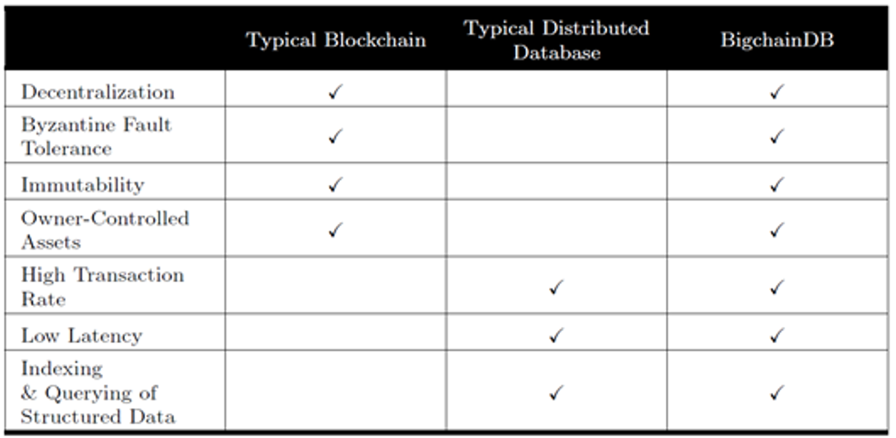
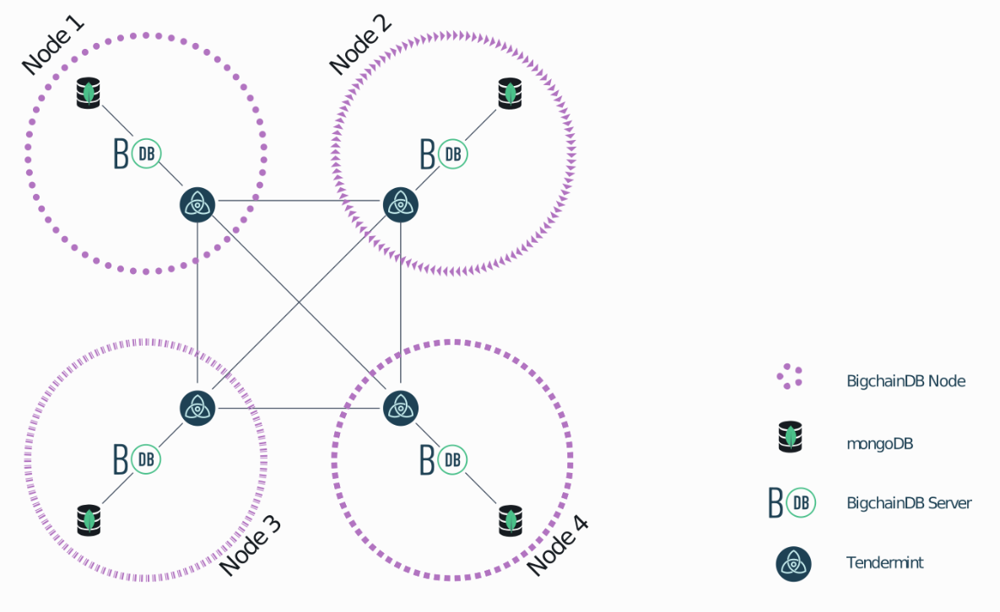

## Abstract

*Blockchain technology is increasingly being developed for use in a broad range of applications, from financial transactions, digital voting systems, identity management, and asset tracking.  The technology is robust, secure, flexible, and could one day bring about fundamental change in a whole host of common computer systems.*

*Digital encryption grew out of the need to keep government secrets private during and after World War II.  The US government and IBM developed DES, the first widely used digital encryption algorithm.  However, due to the subsequent government mandated secrecy around the implementation of DES, and the distrust of the academic community because of this, a movement was spawned that put a premium on individual privacy and decentralized control.  This movement brought together the top minds in encryption and spawned the technology we know of as blockchain today.*

*This paper explores the genesis of encryption, its early adoption, and the government meddling which eventually spawned a movement which gave birth to the ideas behind blockchain.  It also closes with a demonstration of blockchain technology used in a novel way to refactor the traditional design paradigms of databases.*

*Index Terms : Computer network management, Cooperative communication, Cryptographic protocols, Data transfer, Encryption, Distributed databases, Document handling, Fault tolerant control, Identity management systems, Information exchange, Internet, Network function virtualization, Network security, Peer-to-peer computing*

## INTRODUCTION

Blockchain is, at its heart, simply an immutable transaction log, often referred to as a [digital ledger][1], which employs cryptographic hashing techniques in a distributed fashion to create a one-way transaction register which memorializes the characteristics of an interactions between parties and secures those actions with completed proofs of work and a distributed, decentralized, and public log.  It was originally designed as a means to facilitate commerce on the Internet without the need for a trusted intermediary such as a bank or a monopolistic computing company like Microsoft or Google overseeing and injecting itself into transactions. Blockchain however, due to its robustness, versatility, and security, has been leveraged into a whole host of other applications for which trust, privacy, resilience and security are necessities.

This paper will explore the distributed ledger technology known as Blockchain. In this paper we will cover what Blockchain is, the theories and technologies behind Blockchain, its strengths and shortcomings, as well as its current and possible future uses. We will explain the different types of [Blockchains][3] (public, private, and federated), and the pros and cons of each. This paper will conclude with a description of an emerging application of Blockchain, [BigchainDB][16],which is a NoSQL database augmented with the core strengths of Blockchain, its decentralized nature, robustness to node failures, and its security.

## RELATED WORK

### Early Cryptography

Until about the 1970s, cryptography was mainly the purview of state actors. However, in the 70s, two publications brought cryptography into the public eye the US Government's DES,the Data Encryption Standard, and Whitfield Diffie & Martin Hellman's publication on [public key cryptography][6].

### DES

The Data Encryption Standard is a symmetric-key, block cipher algorithm for the electronic data encryption first developed at IBM, and then submitted as a candidate in a invitational study to the National Bureau of Standards, now the national Institute of Standards and Technology, following the agency's invitation to help define a government wide standard encryption algorithm for the protection of sensitive, but unclassified electronic government data.[7] IBM's initial submission was modified to use S-blocks and to decrease the number of bits used for the key as suggested by the National Security Agency before final ratification of the standard.  The final design was a symmetric key, 56-bit, block encryption algorithm using [S-block][8], or substitution blocks.
  
Symmetric-key or shared-key algorithms like DES are cryptographic algorithms the use the same or very mildly transformed keys for both encryption decryption of data. The keys enable the possibility of a secure communication link between 2 or more parties. The requirement of this type of secure channel is that all parties to the communication need to know the secret keys.  This fact represents the main drawback to symmetric key algorithms as the number of communicating parties increases it becomes exceedingly more complex to engineer a secure means of transferring the secret keys before the encrypted communication using the keys can begin.
  
Block ciphers, like DES, are cryptographic algorithms which deterministically encrypt fixed length groups of bits. In a typical block cipher implementation data is split into equal size blocks which are then transformed with a secret key seeding a mathematical transformation. However, since each block is deterministic and unwavering, block ciphers are susceptible to an exploit called differential cryptanalysis in which output blocks are scanned for evidence of non-random behavior caused by some repeating value in the plaintext, and that information is used to reverse engineer the encryption keys.  
  
Substitution blocks, at the time a new feature in cryptography are a cryptographic algorithm in which an input of n bits are transformed into an output of m bits, and where n and m are not necessarily alike.  DES incorporated the first widely used implementation of substitution blocks in its 6x4 s-blocks in which 6 input bits were transformed to 4 output bits. S-blocks serve to obfuscate the deterministic regularities arising from simple block ciphers thus making them more resistant to differential cryptanalysis.

### Early DES Opposition

During the DES public comment period, parts of the proposed standard were deemed classified, and thus could not be vetted by researchers in the field. Also, it was made known that the NIST enlisted the help of the NSA in modifying the initial IBM proposal, and that made people a little bit wary.

Due to the partially classified nature of the publication, the involvement of the NSA, and the introduction of heretofore unknown feature in the design called S-boxes, the initial specification was immediately met with wide skepticism in the academic realm.  Whitefield Diffie and Martin Hellman, prominent cryptography researchers at Stanford University, panned the standard in an ["Exhaustive Cryptanalysis of the NBS Data Encryption Standard"][11]. Primarily their concern was that the 56-bit key proposed by the standard was too short to be secure.  

There was also public skepticism that the classified implementation of the S-boxes, now known as substitution boxes, in the design represented some sort of backdoor introduced by the NSA to allow it to decrypt secure communications.  It wasn't until years later when S-boxes were rediscovered, that it was determined that the inclusion of S-boxes in the DES standard made it more secure against differential cryptanalysis.

However, the NSA did push for a reduction of the key size from the originally proposed 64bits to 48bits.  IBM pushed back and the IBM and the NSA eventually compromised on a 56-bit key.  However, this weakened the standard so much, according to Diffie and Hellman, that state actors and other organizations with deep pockets could theoretically build a computer to crack DES encryption through brute force. In Diffie and Hellman's early [public shaming][4] of DES they made this point in their opening introduction.

Fittingly, in 1998, the Electronic Frontier Foundation built a $200,000 machine, well within the financial means of companies and especially governments, that [cracked DES][5] in a few days. The project was headed by John Gilmore, a founder of the Cypherpunk movement and a cryptographic academic and activist. The goal of the project was to demonstrate that DES was insecure, and that the US government had been telling deliberate lies about the security of DES for some time.

### Public Key Cryptography

Diffie and Hellman and went on to advocate for an asymmetric encryption algorithm with greater complexity of the 56-bit DES and the ability to agree upon a shared key over an unsecure channel.  This process became known as public key encryption and they went on to eventually patent this concept with Ralph C. Merkle in 1977. [The Diffie-Hellman Key Exchange Protocol][11] is what is can become to be named.  

Interestingly though, the concept was actually first conceptualized and secretly described in a now unclassified [paper][13] by James H. Ellis, Clifford Cocks, and Malcolm J. Williamson of GCHQ, the British signals intelligence agency, in 1969.
  
The private key must remain secure, but the public key can be widely disseminated without fear that the encrypted data will be compromised. The security of this cryptographic system is hinged on the sheer complexity and time it would take to factor the product of the two very large prime keys with current technology.

### Cipher Punks

Blockchain technology grew out of the tenants of a group of high tech privacy enthusiasts calling themselves Cypherpunks. The term Cypherpunk is a compound word combining root words *cypher* or  *cipher*, a coded message, and *punk*, in this instance referencing a member of a rebellious counterculture group advocating the widespread use of cryptography as a means to social and political change.
  
The Cypherpunk movement traces its roots to the early days of public key cryptography.  With the initial academic uproar surrounding the distrust of the NSA's involvement in the manipulation of DES, and the secrecy in which the implementation of the algorithm was shrouded in, there began the seeds of dissent and the onus for the beginnings of the Cypherpunk movement.  The eerily prescient early focus of the small, mostly online group was on discussing individual privacy in a digital world, government monitoring, and central authority control of information, all issues which are in national conversation today.
  
The Cypherpunk group started out in the as in informal meetup between tech minded individuals with scofflaw tendencies founded by Eric Hughes, Tim May, and John Gilmore.  These three together with 20 of their friends began meeting regularly in the offices of John Gilmore's company,Cygnus, a stalwart of the burgeoning open source community, in the early 1990s.  
  
Their meetup shortly morphed into a mailing list to broaden its appeal and to attract likeminded individuals from around the world.

One of their primary concern was that of governments and large powerful corporate entities capturing information, as John Gilmore described the problem in a speech at the first ACM conference on Computers in March 1991,
  
  ["In most of Europe, phone companies don't record the phone numbers when you call, and they don't show up on your bill. They only tick off the charges on a meter. Now, I was told that this is partly because the Nazis used the call records that they used to have, to track and identify the opposition after taking over those countries in World War II. They don't keep those records anymore."][9]
  
The mailing list's topics and tenor favored privacy in communications, self-revelation, financial privacy, anonymity, and pseudonyms.  It also derided and actively opposed government data collection, forced self-revelation, and censorship. It is notable that an early and very active, member of the Cypherpunk mailing list was [Julian Assange][15] of Wikileaks infamy, who has made it his life's mission to expose corruption and abuse of power.
  
Privacy in communication was a primary concern of the movement, but equally important to the movement were discussions around financial privacy, as Eric Hughes, one of the founders, puts it in his [Cypherpunk Manifesto][10],
  
  "When I purchase a magazine at a store and hand cash to the clerk, there is no need to know who I am. When I ask my electronic mail provider to send and receive messages, my provider need not know to whom I am speaking or what I am saying or what others are saying to me; my provider only need know how to get the message there and how much I owe them in fees. When my identity is revealed by the underlying mechanism of the transaction, I have no privacy. I cannot here selectively reveal myself; I must always reveal myself."

### BITCOIN

From this primordial stew of technologist, university researchers, cryptographers, a love of privacy in communication and in financial transactions, and a general mistrust of central authorities an anonymous,short (9 pages), but groundbreaking [paper][17], was mailed to the Cypherpunk mailing list in 2008 by Satoshi Nakamoto, fittingly an alias, describing an electronic currency, Bitcoin, based upon cryptographic principals akin to asymmetric encryption, one-way functions, but in reverse.  While Bitcoin was not the first digital currency created, it was the first to solve the problem of double spending and the first to do it without the need for a central authority regulating the transaction.

## BLOCKCHAIN TECHNOLOGY

One of Blockchain's core strengths is its ability to allow for a verifiable transaction to take place without the need for central database or oversight authority. Traditional transactions requires a central authority overseeing or simply recording the transaction to prevent fraud and to provide a verifiable record of was has transpired. Blockchain supplants this requirement with ["cryptographic proof instead of trust, allowing any two willing parties to transact directly with each other without the need for a trusted third party"][17]. The consequences of this breakthrough are hard to overstate.

A Blockchain transaction begins with two willing parties to a transaction. The payor's equity stake, or coin, is recorded as a transaction in a chain of cryptographic blocks secured with his public key, a hash, and the private key of the person he bought his equity stake from and embedded in a "proof of work" block.  The payer then digitally signs a hash of this prior transaction and the public key of the next owner with his private key and then adds this to the end of the coin. The payee can then verify the signatures to verify the chain of ownership. This one-way cryptographic hash is computationally impractical to reverse, and thus this interaction secures the ownership chain; however, it doesn't provide a means to prevent a bad actor from duplicating (double spending) or reversing a transaction.  

The traditional means of ensuring the authenticity of a one-way transaction and to eliminate the problem of double spending is to use a trusted third party such as a bank or some governing body overseeing the transaction.  While this works, it relies on the goodness of the intermediary and a measure of blind faith.  Unfortunately, the intermediary might have other loyalties, an institution could be manned by rogue employees, or the entity could be inundated with entitlement mentality. Thus, this uncertainty manifests itself as an increase in the cost of performing a transaction. It also and has an inherent and an unfortunate but accepted level of grift and risk associated with it.

To get around the need for a central authority, the author(s) of [Bitcoin][17], the first Blockchain technology, employ a proof of work concept in which honest "miner" nodes compete with one another to search for the solution to a difficult secure hash.  When a transaction happens, it is added to a pool of other recent transactions.  These transactions are picked up by special nodes in a peer to peer distributed network called miners.  These miner nodes then search for a specific result to a complex hash comprised from the previous block's hash, a nonce, and a collection of recent transactions that begins with a specific number of zeros bits.  The complexity in finding this hash increases exponentially with the number of zeros specified.

When the hash is found, the miner who found it, adds that block to the end of the chain of blocks and widely publishes it to the network.  Other miner nodes working on that block will accept the block if all transactions in the block are valid and not already spent.  They signal their approval by then stopping trying to find the current block, since it has already been found, and proceed onto the next block using the recently accepted block's hash as the previous block.  

The Ledger is divided into Blocks of equal sizes and each block is connected to its previous block using the cryptographic hash of the data in previous block.  By convention, the longest valid chain is always considered to be the source of truth.  Shorter chains or chains with the same length but with a later timestamp, or chains with unverified blocks are discarded in favor the earliest and longest verifiable chain.

Every new block added to a chain of other blocks represents a non-trivial amount of work measured in electricity and time.  If someone tries to change the value of a record in any block, all the blocks ahead of it are invalidated, thus providing an indication that the data has been tampered.  To modify a past block, an attacker would have to redo the proof-of-work of a block and all blocks after it to catch up with and surpass the work of the honest nodes constantly and continuously finding new blocks.  Assuming that the majority of computing power lies within the pool of honest nodes. The probability of this happening becomes vanishingly small. Conversely, if dishonest nodes do overtake honest nodes in the network, the value of the digital assets would plummet due to the inherent loss of trust, thus negating the spoils of the heist.

Since the ledger is distributed amongst every participant in the network, both miners and transaction participants, and not controlled by a central authority, publishing a fake transaction log again is limited by the ability of the bad actor to completely redo the proofs-of-work in the chain after its dishonest entry.  Ironically then security is provided by publicity.

To incentivize honest nodes to continuously find new blocks and to process transactions to stay ahead of dishonest nodes attempts at rewriting history, miners finding a new block are awarded with a new coin. By convention this coin is recorded as the first transaction in a new block.

Here is a sample transaction between Alice and Bob:

1. Alice initiates a transaction to Bob donating $50 to his charity.
2. Alice’s wallet encrypts her coin with Bob’s public key and signs the transaction with her private key.
3. The transaction will be added to the pending transaction pool along with other transactions on the chain.
4. Miner nodes will then pick up several transactions from the pool and combine them into a block.
5. Miners will then validate all the transactions with application specific rules.
6. Once validated, miners will compete to find a SHA256 hash with a specific number of leading zeros.
7. Once found, the winning miner will broadcast its result to the network.
8. The other miners then validate the solution and if validated accept the block, and then move on to a new block.
9. Once over 50% of the miners on the blockchain accepts the block, the block is added to the blockchain officially.
10. Bob finally sees $50 in his charity donation wallet.
11. The winning miner is awarded with transaction fee and/or a new Bitcoin.

## BLOCKCHAIN TYPES

For the most part, when people talk about Blockchain they are talking about a Public Blockchain like Bitcoin or Ethereum. However, Public Blockchains are only one of three main types of Blockchain along with Federated and Private Blockchains. Here is a description of each type and their uses:

1. [Public][3]: A Blockchain in which anyone can participate. This is the most popular form of Blockchain, but concerning to some in regards to speed and security. Though no real security concerns have been provided, certain industries do not trust that transactions in a public blockchain will be hidden forever and therefore shy away from them.
2. [Federated][3]: A Blockchain that limits the participants to a group of companies. Most commonly used in finance when a little more privacy and speed is desired.
3. [Private][3]: A Blockchain unique to one organization. Most scalable and fast, but the one with the most overhead.

The value of Federated and Private Blockchains is highly questionable. Organizations that implement federated or private blockchains need to weigh the benefit against the overhead of the blockchain system.

## BLOCKCHAIN APPLICATIONS

In 2018, the question ["What is Bitcoin"][30], was the most searched question on Google.  Blockchain's search popularity has declined slightly over the past few years, but interest still appears to remain high.

The following are some of the most successful companies implementing blockchain across a broad cross section of industries according to [CoinSwitch Desk][31].

### Enterprise

- [GEM](https://enterprise.gem.co/): Gem is an Enterprise Blockchain Application involved with industries across the spectrum from tracking diseases on blockchain for the CDC to, tracking crypto investments, to building an operating system healthcare, GEMOS.

### Cybersecurity

- [REMME](https://remme.io/) : A peer to peer public key infrastructure platform for identity management.

### Healthcare

- [Simply Vital Health](https://www.simplyvitalhealth.com/) : A HIPAA compliant heath care solutions provider creating blockchain based applications for patient tracking and electronic health records.

### Banking and Financial

- Barclays : Barclays has embarked on a number of blockchain implementations for finance and has even filed a few patents.  However their stance on blockchain is that it will simply [change the world][33] and that it will be ["a new operating system for the planet"][34].

### Manufacturing

- [Provenance](https://www.provenance.org/technology) : A supply chain management software development company using blockchain to track assets through the manufacturing process.

### Charity

- [Bitgive](https://www.provenance.org/technology) : Bitgive tracks donations from donor to on the ground implementation of the funds.  As a donor you can tracks your gifts and see the benefit that they do.

### Retail

- [OpenBazaar](https://openbazaar.org/) : Buy and sell anything without the traditional middleman like Amazon, e-Bay, or consignment store in the middle.

## BIGCHAINDB

[BigchainDB][16] is a database that builds upon the strengths of a traditional NoSQL database, MongoDB, and augments it with the strengths of Blockchain.  NoSQL databases are known for their speed, scalability, and flexibility yet susceptible to attacks which aim to change its data.  Blockchain is renowned for its immutability, security, and decentralized control, but is often regarded as slow.  For instance it can sometimes take 10 minutes for a transaction to be committed to a Bitcoin block.  Databases running modern web apps need transaction times in milliseconds. By taking the best from both systems, the offspring of these two wedded technologies is better than its parents.  

BigchainDB Features :

- Decentralized Control
- Transaction Immutability
- Standard Queries
- Fast Commits
- Sybil Tolerance

### Decentralized Control

BigchainDB is designed to be [decentralized][20] and distributed but yet synchronized, which makes it ideal for multi-organizational business networks, business to business transactions, or simply for ensuring redundancy and high availability. It also encourages organizations to come out from behind their firewalls and to share data.  BigChainDB is built upon a network of peer nodes, all of which contain an exact eventually consistent copy of the same database.  The beauty of this design is that there is no one single point of failure, and no one single point of control.

Ideally each node in a BigChainDB network is controlled by a different entity.  Even if the nodes are all within the same company, each node is better suited to be controlled by different divisions or different persons in the company.  As in life, the strength of a BigChainDB network comes from its diversity.  The greater the geographic, organizational or other types of diversity present in the network the more fault tolerant it will be.

There is no supervisor node that has can override or supersede the authority of any other node. All nodes are equivalent peers running the same version of software and performing the same set of actions.  

A collection of nodes in a BigChainDB implementation is called a Consortium.  Consortium rules are set forth for each node to follow as a precondition for inclusion in the network, and to provide a tailored system of governance for the network.  These rules are flexible and consequently implementation specific.  For instance the rules for a B2B operation probably  should be different than the rules for an asset tracking system.

As in traditional blockchain implementations like Bitcoin, BigchainDB relies on a consensus of the nodes agreeing on a new block before the new block will be committed to the cryptographic chain.  Therefore, if someone hacked into a node, and tried to commit compromising data to the chain, the other nodes would reject it.  A BigchainDB network can only be impacted if more than 1/3 of the nodes are compromised. If there is at least 2/3 consensus then the network will still allow a commit on the next block.  This also means that even if 1/3 is affected, the data would at least be safe from tampering unless 2/3 of the nodes were compromised.

### Transaction Immutability

Blockchains ledgers are generally considered immutable, unchanging over time.  This is of course a generalization as nothing is impossible, it is just highly unlikely in the cryptographic, probabilistic sense of the word in blockchain. BigchainDB is immutable in the sense that the data is highly resistant to change whether that change be intentional tampering or unintentional through such things as natural disasters or server failures.

Blockchain immutability can be achieved in a number of ways, and some compromises over the original Bitcoin design needed to be made for the specific requirements of a database. For instance Bitcoin Then it uses a proof-of-work backed by a monetary incentive to make it very expensive for a hacker to try and surpass the honest nodes.  This proof of work method however is slow, too slow to be used by a database, and so BigchainDB does not use it.  

[Tendermint][19] is a distributed Byzantine-fault tolerant state machine replication protocol.  It is tolerant to failure of up to 1/3 of the nodes, it is eventually consistent as every node will see the same transaction log and will compute the same state in isolation. BigchainDB cryptographically signs to verify ownership and hashes to detect tampering each transaction. Then BigchaingDB uses Tendermint to replicate and secure the its cryptographic transaction logs across a peer to peer network.

BigchainDB only exposes Create and Transfer API methods.  There is no concept of deleting or updating a record.  Even if the underlying MongoDB database in a node were to be modified with MongoDB native Update and Delete commands.  The hashes would then be violated, and the other nodes would not accept the changes.

### Fast Commits

Commits on a network depend on the performance of the internode communication channels, the speed of the servers, and the number of nodes.  However, commits are not limited to finding a complex proof of work hash.  Thus, while numbers will vary, commits on a Tendermint based network like BigchainDB range from a few milliseconds to a few seconds, which is orders of magnitude faster than Bitcoin.

### Standard Queries

A users on BigchainDB can [query][24] all stored data, all transactions, assets and metadata in a BigchainDB using the standard MongoDB query engine.  Users can even use at least a subset of [SQL][23] with the right tools and drivers.

### Sybil Tolerance

Blockchain networks like Bitcoin allow nodes to freely join the network.  This opens up the possibility that a bad actor could inject enough nodes into the network to control the the balance of computing power, thus controlling the acceptance of valid blocks. This is referred to as a a Sybil attack. Bitcoin limits the possibility of a Sybil attacks by making sure the incentives for honest nodes outweigh the incentives for dishonest ones.  Conversely, in a BigchainDB network, nodes must be added to the network by the governing organization, and so Sybil attacks are a non-issue.

## BigchainDB Tutorial: How to create a digital record of an asset and transfer it to someone else

In this tutorial we cover:

- Creating User Identities
- Creating Digital Assets
- Assigning ownership to assets through a transaction
- Transferring assets between two identities
- Querying the blockchain for a record of these transactions

We are fast approaching a time as a society in which ownership of an asset like a bicycle or a car, or any other type of asset need not be represented by a signed piece of paper which can be lost stolen or forged.  Ownership can be represented as a digital asset in a immutable cryptographically secured database in much more secure and verifiable manner than traditional means.

Our team has prepared a demonstration of a Simple BigchainDB network hosted on AWS.  In this demonstration we take some liberties and we do not follow the best practice of diversifying the nodes as they are all going to be hosted on the same provider, AWS, and obviously controlled by the same users, us.  However, these are reasonable simplifications for a development or demonstration environment.

Details of the setup process are available in [BigChainDBProject_AWSImplementation.pdf](./BigchainDB/BigChainDBProject_AWSImplementation.pdf).  A IPython Juypter notebook, the project documentation is available in [BigChainDBProject_PythonDriver.pdf](./BigChainDBProject_PythonDriver.pdf).

## REFERENCES

[1]: https://blockgeeks.com/guides/what-is-blockchain-technology/ "Judd Bagley (2018 ,  Sep . ).  What is Blockchain Technology? A Step-by-Step Guide For Beginners. Blockgeeks."
[2]: https://medium.com/blockchain-review/how-does-the-blockchain-work-for-dummies-explained-simply-9f94d386e093 "Collin Thompson 2016 Oct. How does the Blockchain Work? (Part 1). The Blockchain Review."
[3]: https://blockchainhub.net/blockchains-and-distributed-ledger-technologies-in-general/ "Collin Thompson (2016 Oct.). Blockchains & Distributed Ledger Technologies. BlockchainHub."
[4]: https://ee.stanford.edu/~hellman/publications/27.pdf "Exhaustive Cryptanalysis of the NBS Data Encryption Standard"
[5]: https://www.foo.be/docs/eff-des-cracker/book/crackingdessecre00elec.pdf "Electronic Frontier Foundation (1998), Cracking DES: Secrets of Encryption Research, Wiretap Politics, and Chip Design, Electronic Frontier Foundation, ISBN ISBN: 1-56592-520-3"
[6]: https://www.cs.jhu.edu/~rubin/courses/sp03/papers/diffie.hellman.pdf "Diffie, Whitfield & Martin Hellman (Nov. 1976), 'New Directions in Cryptography', IEEE Transactions on Information Theory IT-22: 644-654"
[7]: http://# "It was created by IBM's (International Business Machines) Walter Tuchman (1997). 'A brief history of the data encryption standard'. Internet besieged: countering cyberspace scofflaws. ACM Press/Addison-Wesley Publishing Co. New York, NY, USA. pp. 275–280."
[8]: https://ia801307.us.archive.org/33/items/AmericanCryptologyDuringtheColdWar1945-1989BookIII_RetrenchmentandReform1972-1980/American%20Cryptology%20During%20the%20Cold%20War%2C%201945-1989.%20Book%20III_%20Retrenchment%20and%20Reform%2C%201972-1980.pdf  "Thomas R. Johnson (2009-12-18). 'American Cryptology during the Cold War, 1945-1989.Book III: Retrenchment and Reform, 1972-1980, page 232'"
[9]: http://www.toad.com/gnu/cfp.talk.txt "John Gilmore (March 1991), Privacy, Technology, and the Open Society"
[10]: https://www.activism.net/cypherpunk/manifesto.html "A Cypherpunk's Manifesto"
[11]: https://ieeexplore.ieee.org/document/1055638 "Diffie, Whitfield; Hellman, Martin E. (November 1976). 'New Directions in Cryptography'. IEEE Transactions on Information Theory. 22 (6): 644–654. doi:10.1109/TIT.1976.1055638. Archived (PDF) from the original on 2014-11-29."
[12]: https://patents.google.com/patent/US4200770 "Cryptographic apparatus and method"
[13]: https://www.gchq.gov.uk/sites/default/files/document_files/CESG_Research_Report_No_3006_0.pdf "The Possibility of Secure Non-Secret Digital Encryption"
[14]: http://en.citizendium.org/wiki/Cypherpunk/Citable_Version "Cypherpunk/Citable Version"
[15]: https://cryptome.org/0001/assange-cpunks.htm "An Archive of Julian Assange's Cypherpunk Mailing List Posts"
[16]: https://www.bigchaindb.com/ "BigchainDB"
[17]: http://nakamotostudies.org/wp-content/uploads/2018/03/bitcoin.pdf "Bitcoin: A Peer-to-Peer Electronic Cash System"
[18]: https://www.bigchaindb.com/whitepaper/bigchaindb-whitepaper.pdf "BigchainDB 2.0, The Blockchain Database"
[19]: https://www.tendermint.com/docs/introduction/what-is-tendermint.html "What is Tendermint?"
[20]: http://docs.bigchaindb.com/en/latest/decentralized.html "How BigchainDB is Decentralized"
[21]: https://docs.bigchaindb.com/en/latest/immutable.html "How BigchainDB is Immutable"
[22]: https://www.bigchaindb.com/developers/guide/key-concepts-of-bigchaindb/ "Key concepts of BigchainDB"
[23]: https://studio3t.com/knowledge-base/articles/sql-query/ "SQL Query"
[24]: https://docs.bigchaindb.com/en/latest/query.html "Querying BigchainDB"
[25]: https://github.com/bigchaindb/bigchaindb-driver "bigchaindb-driver"
[26]: https://www.python.org/ "Python"
[27]: https://www.mongodb.com/download-center "MongoDB"
[28]: https://mmonit.com/monit/ "Monit"
[29]: http://www.allitebooks.com/cryptography-and-network-security-5th-edition/ "CRYPTOGRAPHY and NETWORK SECURITY PRINCIPLES AND PRACTICE FIFTH EDITION, pg. 94"
[30]: https://trends.google.com/trends/yis/2018/US/e064b3e4-f943-4db4-aa43-411b724839a8/1554073800?hl=en-US&tz=300&sni=3&utm_campaign=yis_2018&utm_content=chart_e064b3e4-f943-4db4-aa43-411b724839a8&utm_medium=website&utm_source=Trends "See the top trending What is...? in United States for 2018, from Google Trends"
[31]: https://coinswitch.co/news/20-blockchain-applications-across-industries-2018 "20 Real-world Blockchain Applications across Industries 2018"
[32]: https://www.bigchaindb.com/features/ "BigchainDB Features"
[33]: https://docs.bigchaindb.com/en/latest/_images/schemaDB.png "BigchainDB Network Diagram"
[34]: https://www.barclayscorporate.com/insights/innovation/what-does-blockchain-do/ "What does blockchain do?"
[35]: https://home.barclays/news/2017/02/blockchain-could-be-new-operating-system-for-the-planet/ "Why blockchain could be a new ‘operating system for the planet"